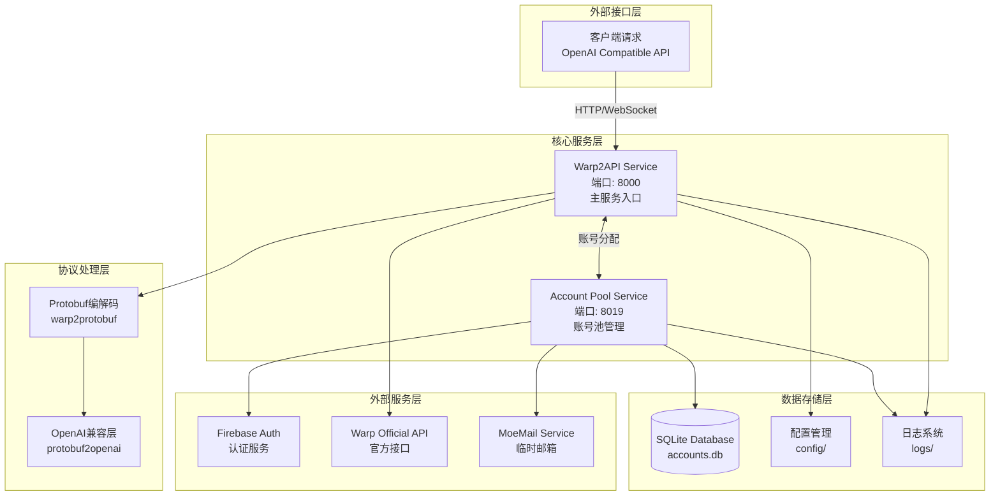
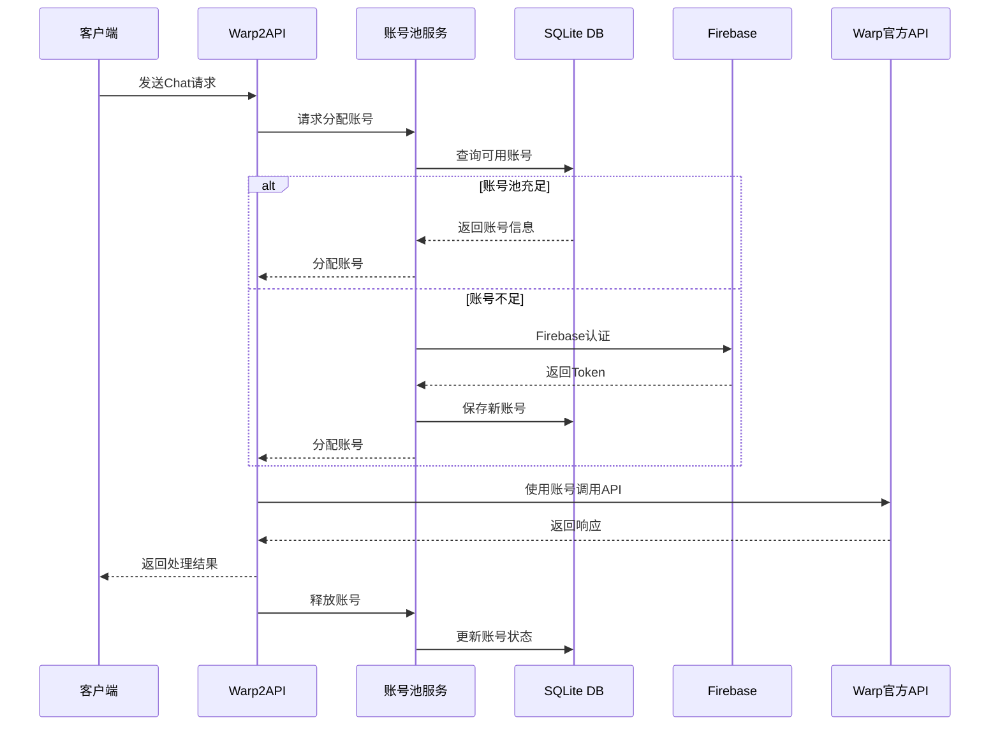

# 🚀 Warp2API - AI代理服务系统

> **项目简要**: Warp2API是一个完整的AI API代理服务，集成了独立的账号池管理系统，支持Protobuf编解码，并提供OpenAI兼容接口。

> 📅 **更新时间**: 2025-09-24 14:07:40
> 🤖 **AI助手**: 此文件为AI开发助手的项目上下文，请勿手动修改

---

## 🏗️ 系统架构总览



## 🎯 核心功能

### 1. **账号池管理服务** 🔐
- 自动注册新账号
- Token刷新管理（遵守1小时限制）
- 账号生命周期管理
- 会话分配与释放
- 并发安全控制

### 2. **Protobuf编解码** 🔄
- JSON ↔ Protobuf转换
- 消息类型路由
- Schema验证与清理
- 流式数据处理

### 3. **OpenAI兼容接口** 🤖
- 标准Chat Completions API
- 模型映射（Claude/GPT）
- 流式响应支持
- 错误处理与重试

### 4. **认证与安全** 🛡️
- Firebase邮箱认证
- JWT Token管理
- 会话管理
- 降级策略（临时账号）

## 📦 项目模块导航

### 🎨 **[主服务模块](./warp2api-main/CLAUDE.md)**
- **路径**: `./warp2api-main/`
- **功能**: Protobuf编解码、OpenAI兼容API、WebSocket监控
- **关键组件**:
  - `server.py` - 服务入口
  - `warp2protobuf/` - Protobuf处理核心
  - `protobuf2openai/` - OpenAI兼容层

### 🔑 **[账号池服务](./account-pool-service/CLAUDE.md)**
- **路径**: `./account-pool-service/`
- **功能**: 独立的账号管理微服务
- **关键组件**:
  - `main.py` - FastAPI服务入口
  - `account_pool/` - 账号池核心逻辑
  - `utils/` - 工具函数

### 🔧 **配置与脚本**
- `config/` - 环境配置文件
- `start_production.sh` - 生产环境启动脚本
- `stop_production.sh` - 服务停止脚本
- `logs/` - 运行日志目录

## 🔄 数据流转路径



## 🚦 服务端口映射

| 服务名称 | 端口 | 协议 | 说明 |
|---------|------|------|------|
| Warp2API主服务 | 8000 | HTTP/WS | 对外提供API服务 |
| 账号池服务 | 8019 | HTTP | 内部账号管理API |
| 健康检查 | /health, /healthz | HTTP | 服务状态监控 |

## ⚡ 快速启动指南

```bash
# 1. 启动所有服务
./start_production.sh

# 2. 检查服务状态
curl http://localhost:8019/health   # 账号池健康检查
curl http://localhost:8000/healthz  # 主服务健康检查

# 3. 查看账号池状态
curl http://localhost:8019/api/accounts/status | jq

# 4. 停止服务
./stop_production.sh
```

## 🛡️ 关键配置项

```env
# 账号池配置
POOL_MIN_SIZE=10          # 最小账号数
POOL_MAX_SIZE=100         # 最大账号数
ACCOUNTS_PER_REQUEST=1    # 每次请求分配数

# 服务配置
USE_POOL_SERVICE=true     # 使用账号池
POOL_SERVICE_URL=http://localhost:8019
LOG_LEVEL=INFO           # 日志级别
```

## 📊 监控与维护

### 日志查看
```bash
tail -f logs/pool-service.log  # 账号池日志
tail -f logs/warp2api.log     # 主服务日志
```

### 账号池管理
```bash
# 手动补充账号
curl -X POST http://localhost:8019/api/accounts/replenish \
  -d '{"count": 10}'

# 刷新Token
curl -X POST http://localhost:8019/api/accounts/refresh-tokens
```

## 🎯 技术栈

- **语言**: Python 3.8+
- **Web框架**: FastAPI, uvicorn
- **数据库**: SQLite
- **认证**: Firebase Auth
- **协议**: Protocol Buffers
- **日志**: Python logging
- **并发**: asyncio, threading

## 📝 开发规范

### 代码组织
- 模块化设计，每个服务独立运行
- 使用类型注解提高代码可读性
- 完善的错误处理和日志记录
- 线程安全的并发控制

### API设计
- RESTful风格接口
- 标准化响应格式
- 完整的请求验证
- 详细的错误信息

## 🔍 故障排查

| 问题 | 可能原因 | 解决方案 |
|-----|---------|----------|
| 服务无法启动 | 端口占用 | 检查8000/8019端口 |
| 账号池为空 | 注册失败 | 检查Firebase配置 |
| Token过期 | 刷新限制 | 等待1小时后刷新 |
| 连接超时 | 网络问题 | 检查防火墙设置 |

## 📚 相关文档

- [部署指南](./DEPLOYMENT.md)
- [项目结构](./PROJECT_STRUCTURE.md)
- [README](./README.md)

---

> 💡 **提示**: 使用模块导航快速跳转到具体组件的详细文档